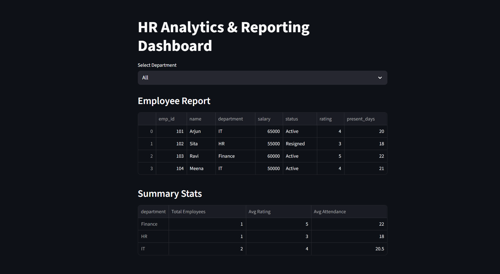

# HR Analytics & Reporting Dashboard

A comprehensive Python-based HR analytics dashboard that processes employee data, provides interactive reporting capabilities, and generates actionable insights for HR teams and management.



## 🌟 Features

- **Interactive Dashboard**: Clean, modern web interface for exploring HR data
- **Department Filtering**: Filter employees and statistics by department
- **Employee Management**: View detailed employee information including ratings and attendance
- **Summary Analytics**: Comprehensive department-wise statistics and KPIs
- **Data Export**: Generate reports and visualizations for stakeholders
- **SQLite Database**: Lightweight, file-based database for quick local analytics

## 📊 Key Metrics

- Employee status tracking (Active/Resigned)
- Department-wise employee distribution
- Performance ratings and attendance tracking
- Salary information and compensation analysis
- Employee presence/absence monitoring

## 🏗️ Project Structure

```
hr-analytics-dashboard/
├── data/                 # Raw CSV/Excel input files
├── frontend/            # Web dashboard UI components
├── reports/             # Generated PDF/CSV reports
├── hr_dashboard.py      # Main application script
├── hr_data.db          # SQLite database
├── OUTPUT.png          # Dashboard screenshot
└── README.md           # Project documentation
```

## 🚀 Quick Start

### Prerequisites

- Python 3.8+
- pip package manager

### Installation

1. Clone the repository:
   ```bash
   git clone https://github.com/yourusername/hr-analytics-dashboard.git
   cd hr-analytics-dashboard
   ```

2. Install dependencies:
   ```bash
   pip install -r requirements.txt
   ```

3. Set up the database:
   ```bash
   python hr_dashboard.py --build-db
   ```

### Usage

1. **Start the dashboard**:
   ```bash
   python hr_dashboard.py --serve
   ```
   Access the dashboard at `http://localhost:8501`

2. **Generate reports**:
   ```bash
   python hr_dashboard.py --run-analysis
   ```

3. **Update database with new data**:
   ```bash
   python hr_dashboard.py --build-db --run-analysis
   ```

## 📈 Dashboard Features

### Employee Report
- Comprehensive employee listing with key information
- Employee ID, name, department, salary, status
- Performance ratings and attendance tracking
- Sortable and filterable data table

### Summary Statistics
- **Total Employees** by department
- **Average Rating** across teams
- **Average Attendance** metrics
- Real-time data aggregation

### Department Analysis
- Finance, HR, IT department breakdown
- Cross-departmental comparisons
- Performance and attendance insights

## 🗄️ Data Schema

The dashboard works with employee data containing:

```sql
employees:
- emp_id: Employee identifier
- name: Employee name
- department: IT, HR, Finance, etc.
- salary: Compensation amount
- status: Active/Resigned
- rating: Performance rating (1-5)
- present_days: Attendance tracking
```

## 📋 Sample Data Format

Place your HR data in the `data/` folder with the following structure:

| emp_id | name  | department | salary | status   | rating | present_days |
|--------|-------|------------|--------|----------|--------|--------------|
| 101    | Arjun | IT         | 65000  | Active   | 4      | 20           |
| 102    | Sita  | HR         | 55000  | Resigned | 3      | 18           |

## 🛠️ Configuration

### Environment Variables
Create a `.env` file for custom configuration:
```env
DATABASE_PATH=hr_data.db
DATA_FOLDER=data/
REPORTS_FOLDER=reports/
DEFAULT_PORT=8501
```

### Command Line Options
- `--build-db`: Initialize/update SQLite database
- `--run-analysis`: Generate reports and analytics
- `--serve`: Start web dashboard
- `--port`: Custom port (default: 8501)
- `--output-dir`: Custom output directory

## 📊 Analytics Capabilities

- **Attrition Analysis**: Track employee turnover patterns
- **Performance Metrics**: Rating distributions and trends
- **Attendance Monitoring**: Present days tracking and analysis
- **Compensation Analysis**: Salary distributions by department
- **Department Insights**: Team-specific KPIs and comparisons

## 🤝 Contributing

1. Fork the repository
2. Create a feature branch: `git checkout -b feature-name`
3. Commit changes: `git commit -am 'Add new feature'`
4. Push to branch: `git push origin feature-name`
5. Submit a Pull Request

## 🔮 Roadmap

- [ ] Add data visualization charts
- [ ] Implement user authentication
- [ ] Export functionality (PDF/Excel)
- [ ] Real-time data sync
- [ ] Mobile responsive design
- [ ] Advanced filtering options
- [ ] Predictive analytics features


## 🙏 Acknowledgments

- Built with Python and modern web technologies
- Inspired by industry-standard HR analytics platforms
- Designed for ease of use and scalability

## 📞 Support

For questions, issues, or feature requests:
- Open an issue on GitHub
- Contact the maintainer: [saisai96161@gmail.com]

---

**Note**: Ensure all employee data is anonymized and complies with privacy regulations when using this dashboard.
